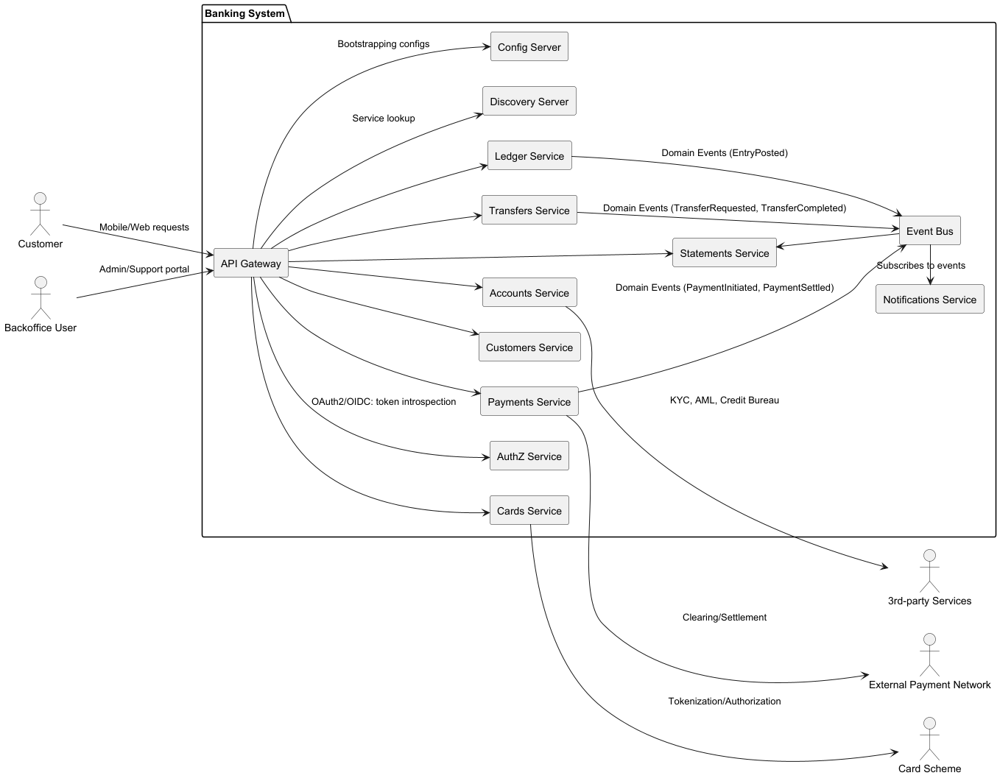

# Banking System (Microservices)

This repository contains a sample banking system implemented with a microservices' architecture. 
Core services include:
- accounts, payments, transfers, ledger, customers, cards, statements, notifications
- gateway (API Gateway), discovery-server (service registry), config-server (externalized config), authz (authorization)
- common (shared utilities)

## Architecture Diagrams
